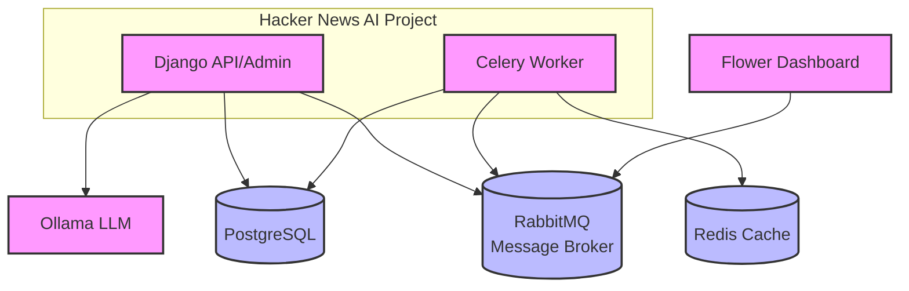

# Hacker News AI 

A full-stack application that demonstrates the integration of Django, PostgreSQL, Celery, and AI (Ollama) to create an intelligent Hacker News reader. This project fetches stories from Hacker News, stores them in a database, and provides AI-powered analysis capabilities.

## Prerequisites
- Git
- Docker and Docker Compose ([Installation Instructions](https://docs.docker.com/compose/install/))
- At least 4GB of RAM (for running Ollama)

## Local Setup
Create the `.env` file, so docker compose can read the variables.
```bash
cp .env.example .env
```

Build and run the containers.
```bash
docker compose up --build -d
```

Install the `mistral` Ollama Model.
```bash
docker compose exec ollama ollama pull mistral
```

Migrate the database.
```bash
docker compose exec app python manage.py migrate
```

Create a Superuser (to login to the admin).
```bash
docker compose exec app python manage.py createsuperuser
```

Populate the Database with Stories. This will queue up celery tasks that save the stories, comments, and users for about 50 articles.
```bash
docker compose exec app python manage.py sync_stories
```

Navigate to http://localhost:8000 to view the website.

## Docker Compose Containers
| Name          | Port  | Link                           | Description                     |
| ------------- | ----- | ------------------------------ | ------------------------------- |
| app           | 8000  | [link](http://localhost:8000)  | Django API/Website/Admin        |
| postgres      | 5432  | -                              | Postgres DB                     |
| ollama        | 11434 | -                              | Ollama AI                       |
| celery-worker | -     | -                              | Celery worker                   |
| redis         | 6379  | -                              | Celery task results backend     |
| flower        | 5555  | [link](http://localhost:5555)  | Website to watch celery workers |
| rabbitmq      | 5672  | -                              | Message Queue Broker            |
| rabbitmq      | 15672 | [link](http://localhost:15672) | Message Queue Web UI            |

## Architecture

