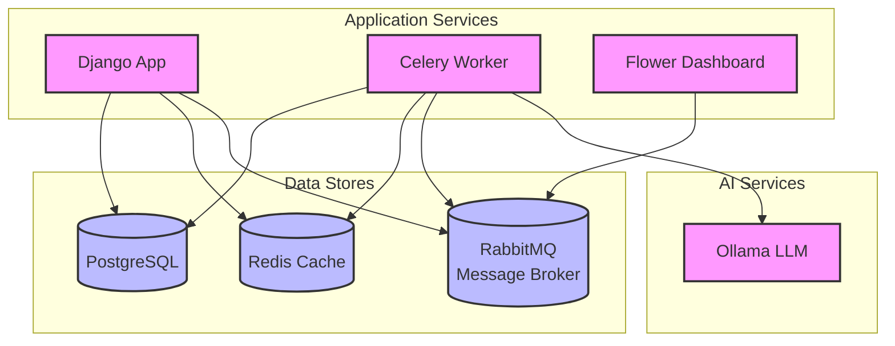

# Hacker News AI 

## Local Setup
Create the .env file and fill it out
```bash
cp .env.example .env
```

Run the server
```bash
docker compose up --build -d
```

Install Ollama Model
```bash
docker compose exec ollama ollama pull mistral
```

Migrate the database
```bash
docker compose exec app python manage.py migrate
```

Create a Superuser (to login to the admin)
```bash
docker compose exec app python manage.py createsuperuser
```

Populate the Database with Stories
```bash
docker compose exec app python manage.py sync_stories
```

Navigate to http://localhost:8000


## Docker Compose Containers
| Name          | Port  | Link                           | Description                     |
| ------------- | ----- | ------------------------------ | ------------------------------- |
| app           | 8000  | [link](http://localhost:8000)  | Spec Catalyst Django API        |
| postgres      | 5432  | -                              | Spec Catalyst Postgres DB       |
| ollama        | 11434 | -                              | Ollama AI                       |
| celery-worker | -     | -                              | Celery worker                   |
| redis         | 6379  | -                              | Database for RabbitMQ           |
| flower        | 5555  | [link](http://localhost:5555)  | Website to watch celery workers |
| rabbitmq      | 5672  | -                              | Message Queue Broker            |
| rabbitmq      | 15672 | [link](http://localhost:15672) | Message Queue Web UI            |


## Architecture

